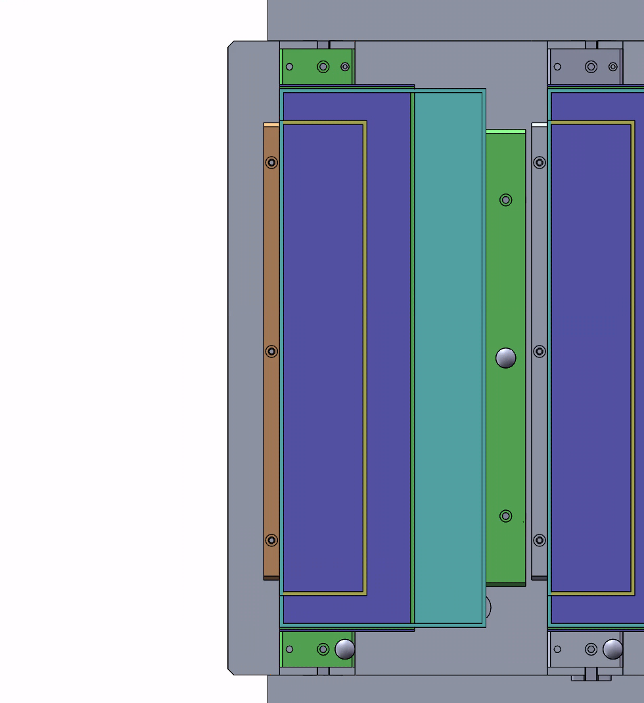
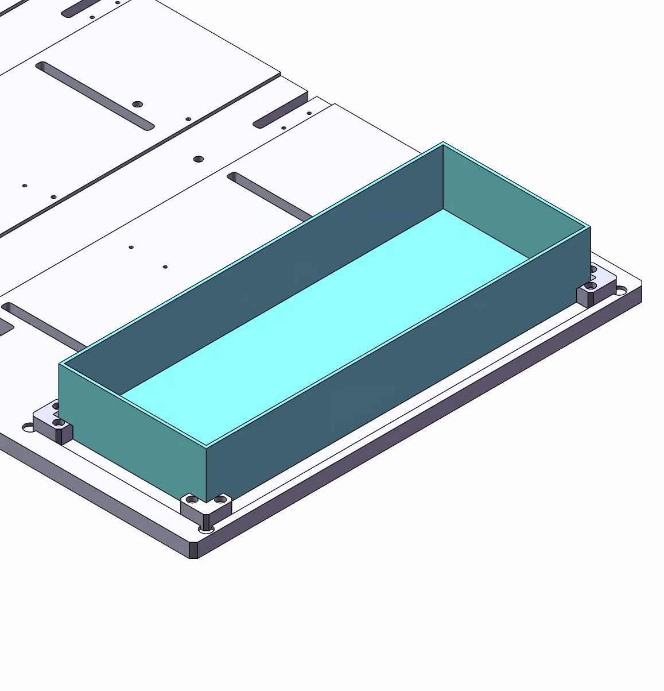
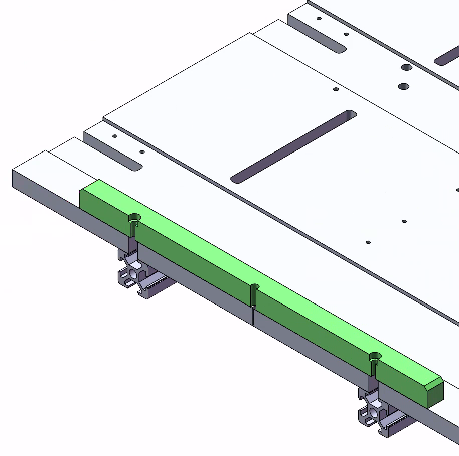
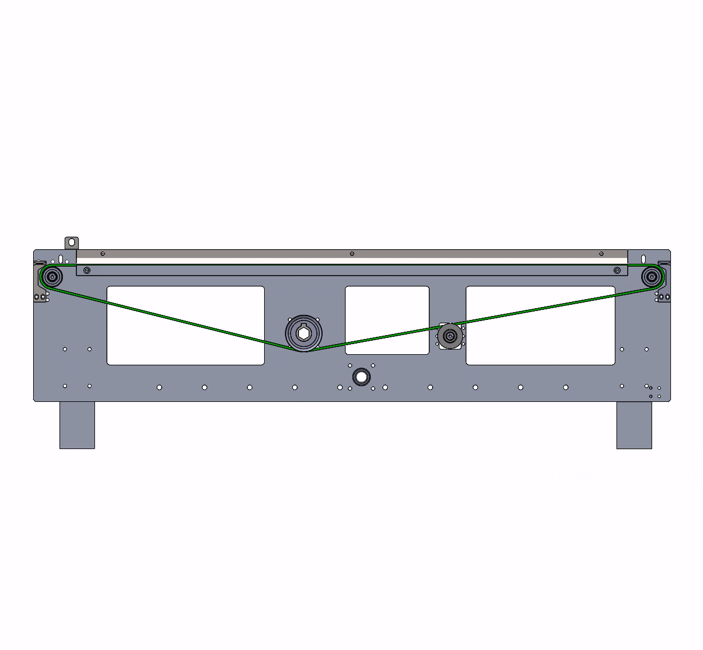
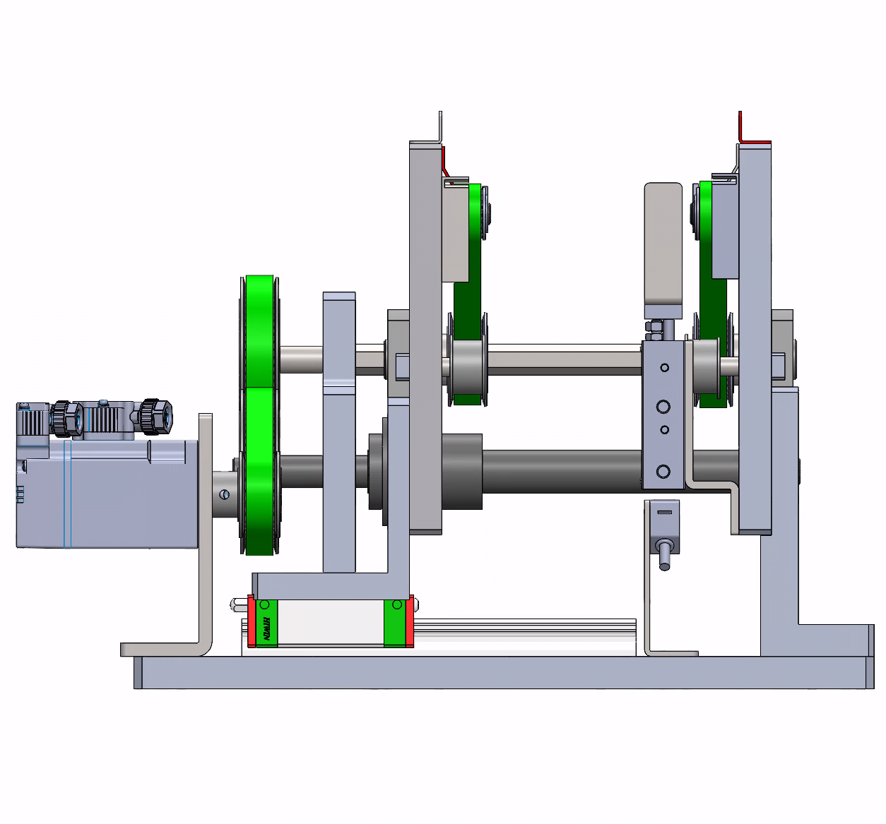
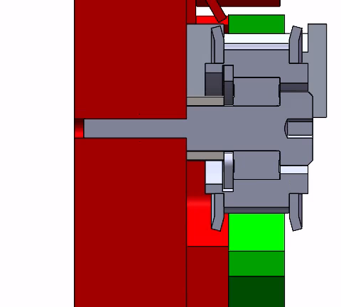

---
tags:
  - "#非标设计"
---

### 常识问题

- 1.根据螺纹底孔确认螺栓间隙空尺寸。
- 2.有通过槽型进行配合的零部件，槽宽应当标准公差，公差再0.01-0.03mm或者0.02-0.03mm，这是通用公差标注方法。
- 3.干涉问题。如何检查？
- 4.确保图纸属性与bom表属性相同。
- 5.确保图纸数量与bom表零件数量相同。

### 功能需求

- 1.天车下料，四个料盒中产生一个料盒，其中确实一片产品，需要从库位中的对应料盒取一片，送进缺失层。
- 2.库位20个，可调整宽度、长度以兼容不同尺寸料盒。
- 3.库位某个料盒产品消耗完需要补料。
- 4.补料总共4种料，分6个区域，每个区域可放置四种不同尺寸料盒，从中取料补料。1个ng料盒。
- 5.补料前需要对产品扫码，切角。

### 取补料产品，扫码、切角

- 1.六个料盒放置位，一个ng料盒用于放扫码失败的产品。

六个区域的料盒都需要定位。
料盒统一一面作为基准面，设置固定挡板，另外三面设置可调挡板。
挡板通过螺栓固定在型材槽内，挡板中心通过柱塞固定，需要调节是打开柱塞-移动位置（挡板被约束只能沿型材内槽方向移动）-到位关闭柱塞。

ng料盒定位，四角直角定位件，为方便定位件安装，地板沉槽，四边为定位件定位。

- 2.切角、扫码、测厚。产品被放在上面，反转产品被输送到后方切角、扫码、测厚；正转送走产品。

输送功能，一个主动轮带两个从动轮，皮带外侧设置张紧惰轮。

输送线兼容四种产品宽度，宽度范围：58-100mm。要求输送线可变距离。
通过电机-丝杆组件推动一边左右活动；
主动轴要满足催动主动轮转动、线体一边左右活动的功能，形状为五边形能够卡住轴套，转动时轴套能跟着转动，左右活动时轴套能在轴上左右活动。

### 输送组件

为了避免皮带惰轮与线体侧面摩擦，中间应设置垫片，垫片外径应保证垫片整体紧贴轴承面而不是惰轮侧面。
贴近惰轮侧面则与目的相悖，反而引起惰轮无法转动的问题。