---
tags:
  - "#非标设计"
---

### 常识问题

- 1.根据螺纹底孔确认螺栓间隙空尺寸。
- 2.有通过槽型进行配合的零部件，槽宽应当标准公差，公差再0.01-0.03mm或者0.02-0.03mm，这是通用公差标注方法。
- 3.干涉问题。如何检查？
- 4.确保图纸属性与bom表属性相同。
- 5.确保图纸数量与bom表零件数量相同。

### 功能需求

- 1.天车下料，四个料盒中产生一个料盒，其中确实一片产品，需要从库位中的对应料盒取一片，送进缺失层。
- 2.库位20个，可调整宽度、长度以兼容不同尺寸料盒。
- 3.库位某个料盒产品消耗完需要补料。
- 4.补料总共4种料，分6个区域，每个区域可放置四种不同尺寸料盒，从中取料补料。1个ng料盒。
- 5.补料前需要对产品扫码，切角。

### 取补料产品，扫码、切角、测厚

- 1.六个料盒放置位，一个ng料盒用于放扫码失败的产品。

六个区域的料盒都需要定位。
料盒统一一面作为基准面，设置固定挡板，另外三面设置可调挡板。
挡板通过螺栓固定在型材槽内，挡板中心通过柱塞固定，需要调节是打开柱塞-移动位置（挡板被约束只能沿型材内槽方向移动）-到位关闭柱塞。

ng料盒定位，四角直角定位件，为方便定位件安装，地板沉槽，四边为定位件定位。

- 2.切角、测厚。产品被放在上面，反转产品被输送到后方切角、扫码、测厚；正转送走产品。

输送功能，一个主动轮带两个从动轮，皮带外侧设置张紧惰轮。输送皮带需要皮带导向槽。侧面需要贴一层不锈钢钣金，增强耐磨属性。
输送线前段和后段需要有漫反射传感器检测产品。

为了避免皮带惰轮与线体侧面摩擦，中间应设置垫片，垫片外径应保证垫片整体紧贴轴承面而不是惰轮侧面。
贴近惰轮侧面则与目的相悖，反而引起惰轮无法转动的问题。

产品进入输送线-反转产品进入切角、扫码、测厚区域被检测到-停转-切角、扫码、测厚完成-正传进入前段区域-被检测到-停转-阻挡打开。检测传感器要在特定位置作为输送线、测厚扫码切角、阻挡运作的信号。

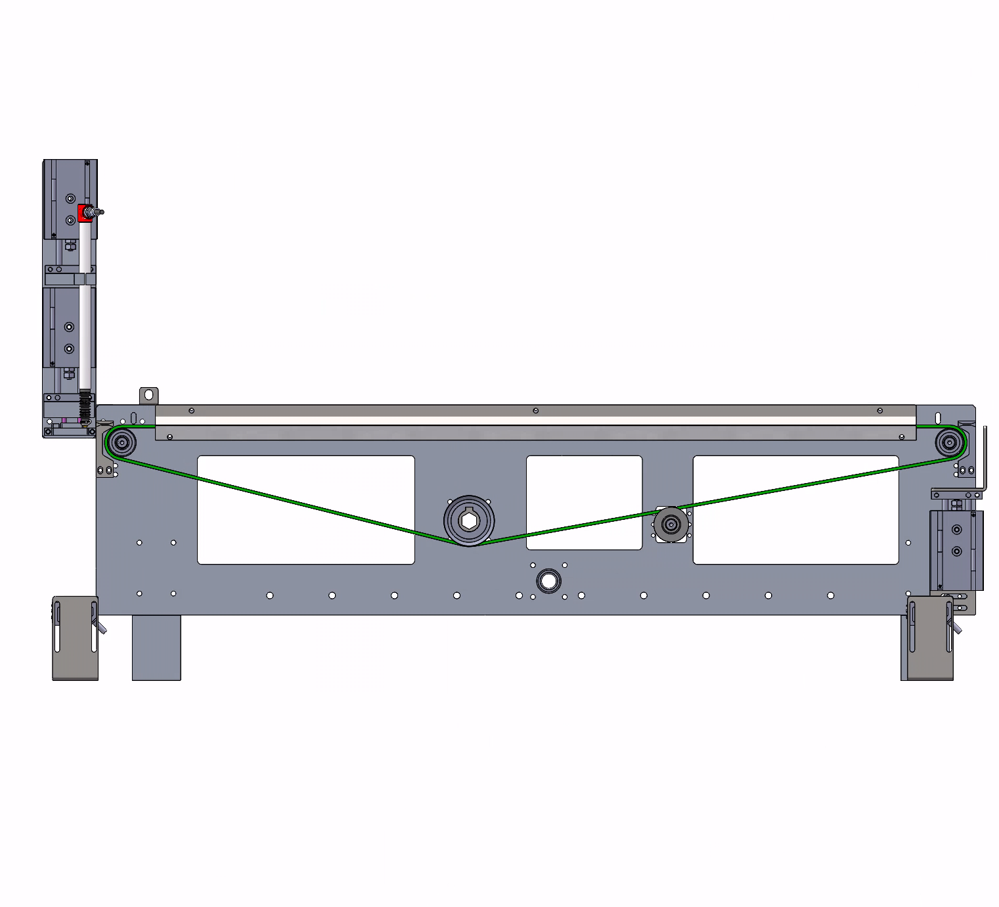

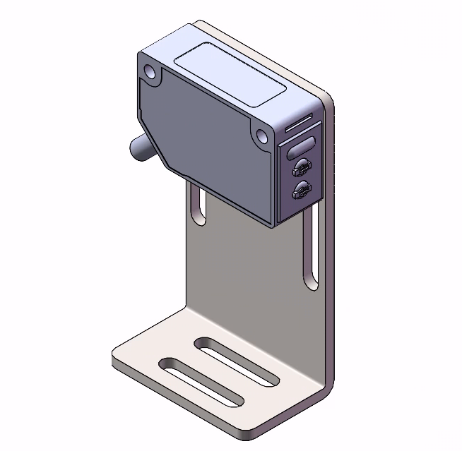

输送线兼容四种产品宽度，宽度范围：58-100mm。要求输送线可变距离。
通过电机-丝杆组件推动一边左右活动；
主动轴要满足催动主动轮转动、线体一边左右活动的功能，形状为五边形能够卡住轴套，转动时轴套能跟着转动，左右活动时轴套能在轴上左右活动。

产品导向功能。产品厚度很薄，最薄产品0.01mm，容易翘曲。为了避免这个问题，在进入和离开输送线都需要在前后端设置导向槽。

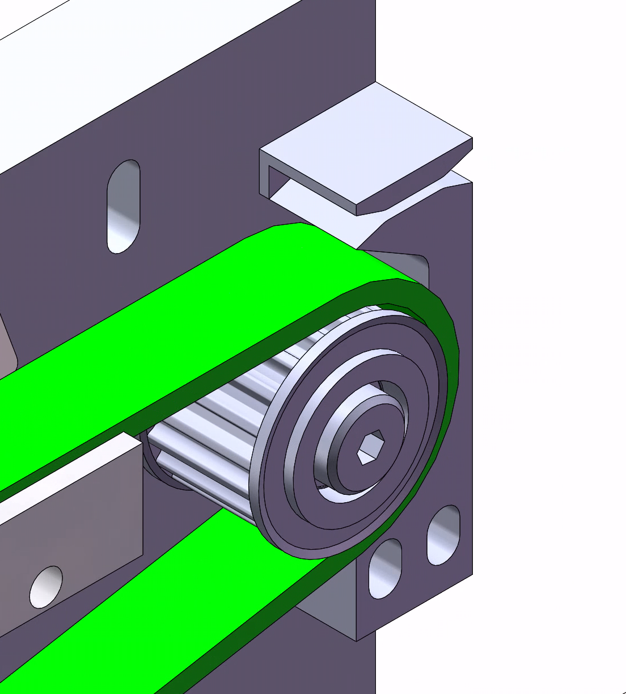

测厚，产品到位，被挡板挡住；下层气缸下压压紧产品；上层气缸下压带动位移传感器测厚。
切角2*2mm，产品到位后-气缸下压-压紧产品的同时，刀口完成切角-下方光纤检测切角-毛细管吹风吹去光线头碎屑。
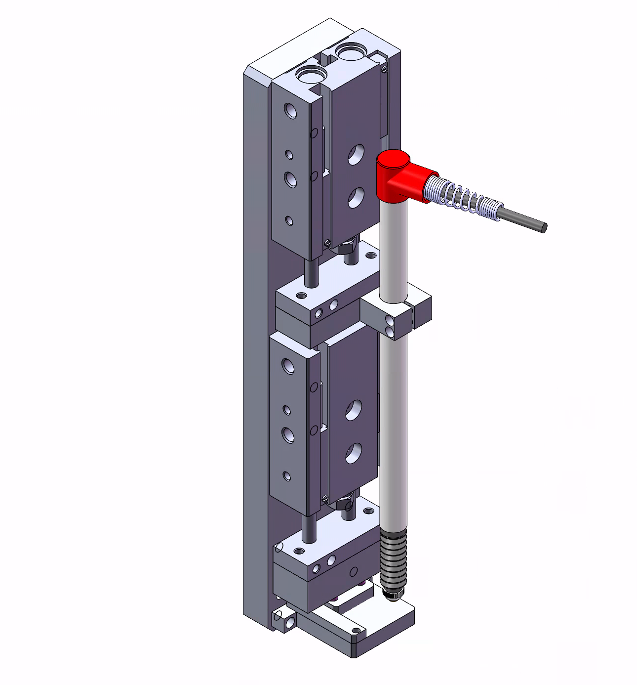
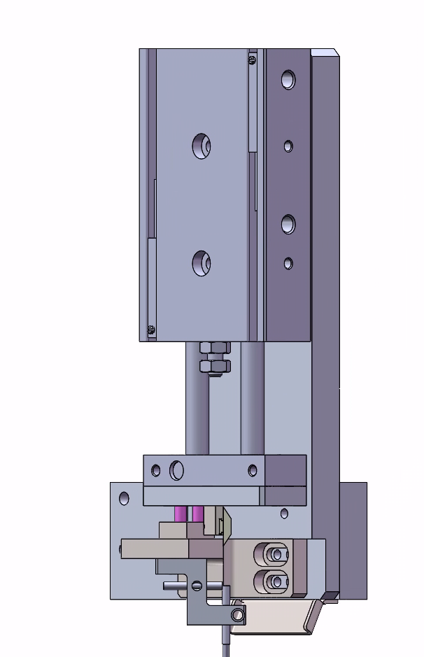

- 3.取料、扫码。

横向模组往返料盒与输送线，拖带吸盘取料、放料。
吸盘组件可边距，支持不同宽度产品吸取。
带电容式接近开关，识别金属产品。
带扫码头。

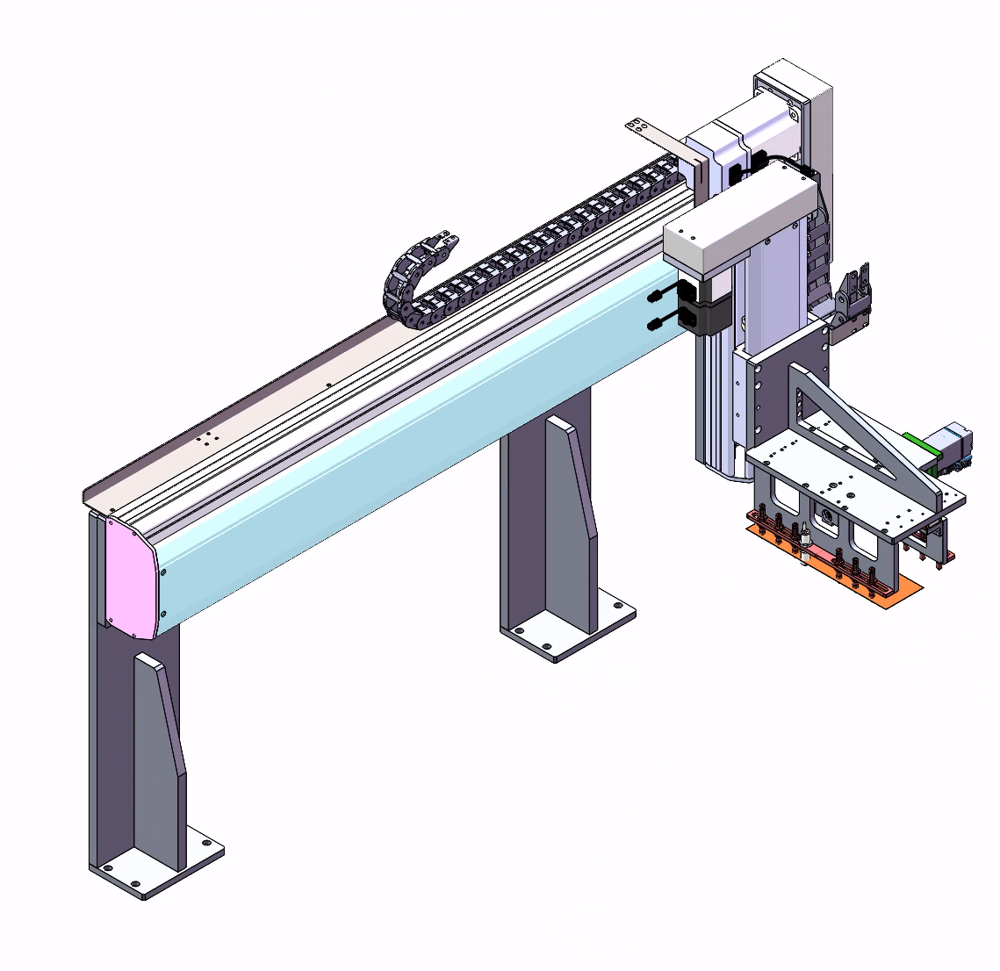
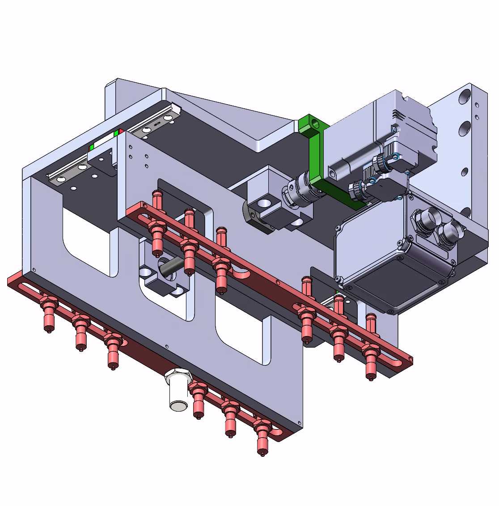

### 补料

模组覆盖高度范围：库位最低高度-工作位最高高度；宽度范围：库位最左-工作位最右。
模组推动输送线对接中转输送线、库位、工作位三个区域完成补料。

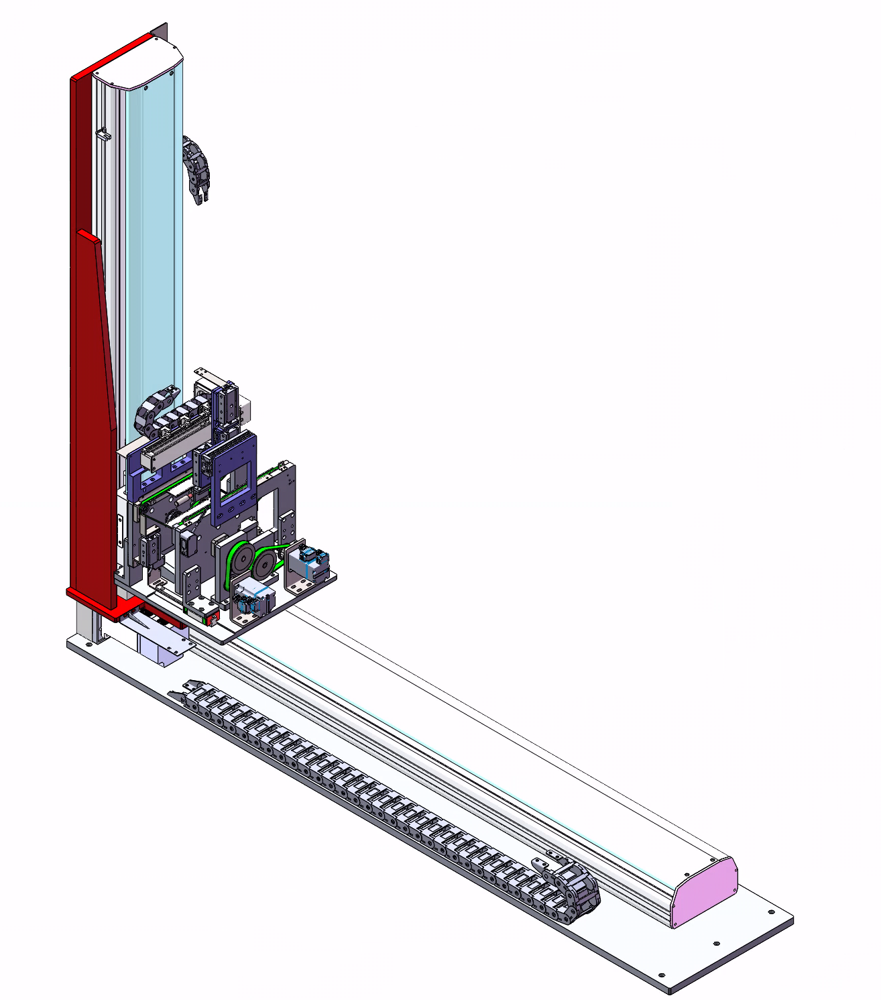

输送线与中转区域的输送线功能相同，尺寸不同。具备输送、皮带导向、产品导向、边距、检测产品、阻挡功能。

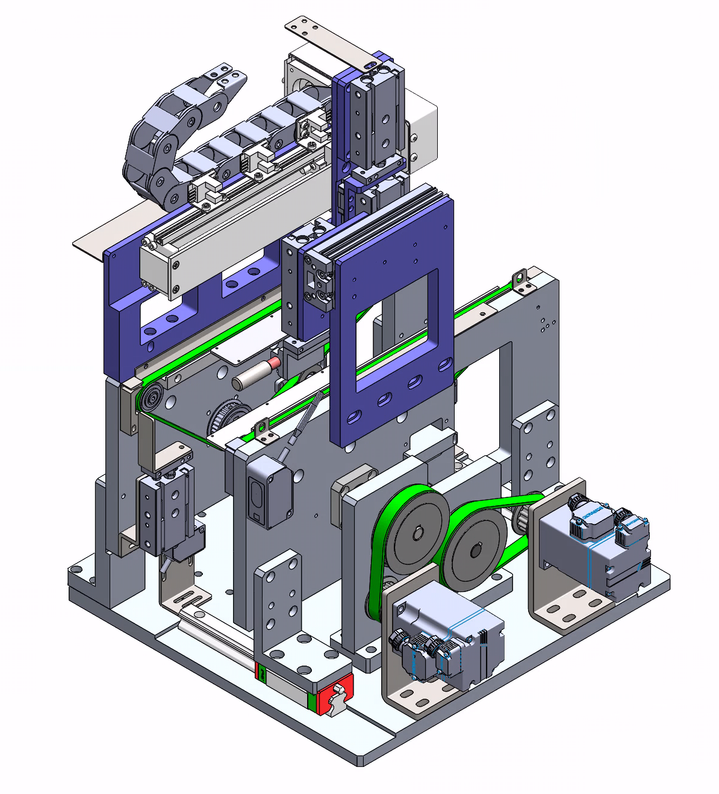

新增推料、取料、扫片功能。

- 1.推料。

横向气缸让推杆推动产品进入料盒，竖向气缸收起推杆，避免阻挡产品输送或压坏产品。
推杆推满产品后弹簧压缩，推杆往后移动碰到接近开关，报警。

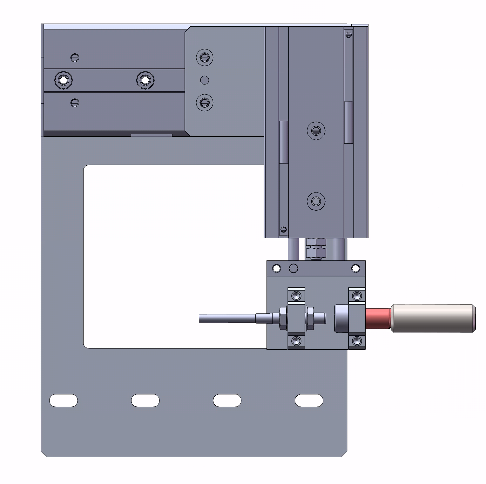

- 2.取料。

横向模组将吸盘推入料盒吸取产品，将产品拉到输送线上。下方气缸让吸盘进入工作位置，两个气缸同时伸出避开推杆工作位置。

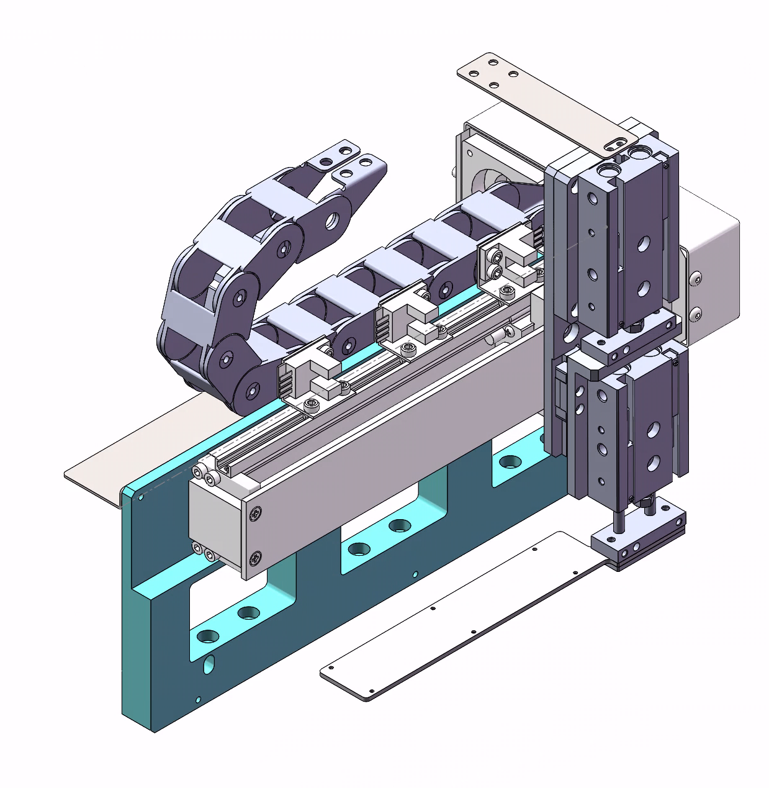